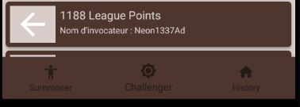
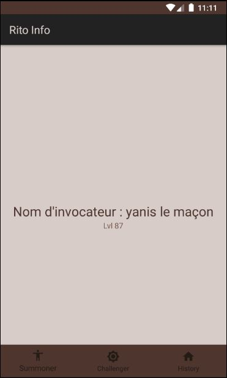
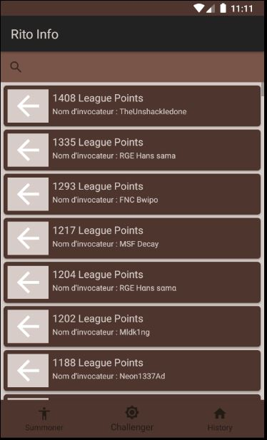

# RitoInfo
Simple application pour intéragir avec l'API de riotgames.
## Presentation
Je voulais faire une application pouvant :
 - Lister tout les champions du jeu ainsi que leurs kit de sort etc..
 - Lister l'historique du joueur séléctionné
 - Donner le classement des meilleurs joueurs (challengers)
Le problème à été la gestion d'une réponse de l'endpoint des matches qui renvoie un object unique contenant un attribut (parmis plusieurs) qui contient un tableau d'objet (les objets que je recherchais).
Cela ma pris trop de temps et à mangé sur le reste du temps disponible.

## Consignes
 - Fragments **Fait**
 - Appel API via client retrofit **Fait**
 - Architecture MVC **Fait**
 
 ## Fonctionnalités
  - Utilisation d'une barre de navigation pour switcher de fragment
  
  
  
  - Affichage d'un fragment avec le nom et le lvl du joueur (en dur seulement, pas de traitement sur le SearchView)
  
  
  
  - Affichage de la liste des meilleurs joueurs de la région EUW (Europe de l'Ouest) avec leurs LP (League Points), il manque le lien avec l'iconId de l'objet Summoner + récuperation du sprite de l'icone en question
  
  
  
  - Un toast d'erreur est affiché en case d'erreur avec l'API ou tout simplement de problème de connexion avec celle-ci
  
  ## Ce que j'ai appris
  Ce semmestre j'ai appris :
   - L'utilisation des Fragments
   - L'utilisation de la BottomNavigationBar
   - Qu'il fallait que je bosse mon design
   
:warning: **Il vous faudra remplacer la variable ```riotAPIToken``` qui se trouve dans ```/app/src/main/java/com/example/ritoinfo/Model/RiotLoLAPI.java```par votre propre "developer API KEY" que vous pouvez génerer avec votre compte [ici](https://developer.riotgames.com/) car Riot a une politique strict quand aux limitations de l'utilisation de leurs APIs.**

Si vous avez des questions n'hésitez pas à me contacter par Email à dumortier@et.esiea.fr
